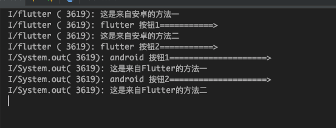

# FlutterDemo
Flutter与Android之间方法互相调用
在安卓中写了两个方法：

```java
private String androidMethod2() {
    return "这是来自安卓的方法二";
}

private String androidMethod1() {
    return "这是来自安卓的方法一";
}
```

在flutter中也写了两个方法：

```dart
String flutterMethod1() {
  return "这是来自Flutter的方法一";
}

String flutterMethod2() {
  return "这是来自Flutter的方法二";
}
```

点击按钮互相调用。

flutter调用Andorid

```dart
IconButton(
    icon: Icon(Icons.add),
    onPressed: () async {
      String message =
          await methodChannel.invokeMethod('androidMethod1');
      print(message);
      print('flutter 按钮1===========>');
    }),
IconButton(
    icon: Icon(Icons.delete),
    onPressed: () async {
      String message =
          await methodChannel.invokeMethod('androidMethod2');
      print(message);
      print('flutter 按钮2===========>');
    }),
```

Android调用Flutter

```java
@Override
public void onClick(View v) {
    switch (v.getId()) {
        case R.id.btn1:
            methodChannel.invokeMethod("flutterMethod1", null, new MethodChannel.Result() {
                @Override
                public void success(Object o) {
                    String message = (String) o;
                    System.out.println(message);
                }

                @Override
                public void error(String s, String s1, Object o) {

                }

                @Override
                public void notImplemented() {

                }
            });
            System.out.println("android 按钮1====================>");
            break;
        case R.id.btn2:
            methodChannel.invokeMethod("flutterMethod2", null, new MethodChannel.Result() {
                @Override
                public void success(Object o) {
                    String message = (String) o;
                    System.out.println(message);
                }

                @Override
                public void error(String s, String s1, Object o) {

                }

                @Override
                public void notImplemented() {

                }
            });
            System.out.println("android 按钮2====================>");
            break;
    }
}
```

在Andorid中声明

```java
methodChannel = new MethodChannel(flutterView, CHANNEL);
methodChannel.setMethodCallHandler((methodCall, result) -> {
    if (methodCall.method.equals("androidMethod1")) {
        result.success(androidMethod1());
    } else if (methodCall.method.equals("androidMethod2")) {
        result.success(androidMethod2());
    }
});
```

在Flutter中声明

```dart
@override
void initState() {
  methodChannel.setMethodCallHandler(_handlePlatformIncrement);
  super.initState();
}

Future<dynamic> _handlePlatformIncrement(MethodCall call) async {
  if (call.method == 'flutterMethod1') {
    return flutterMethod1();
  } else if (call.method == 'flutterMethod2') {
    return flutterMethod2();
  }
  return '';
}
```

最终效果运行如下：



